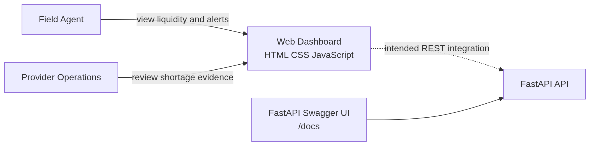
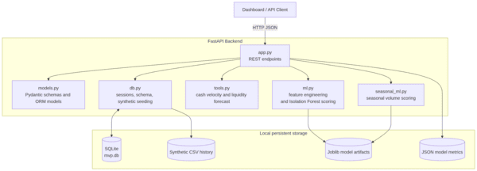
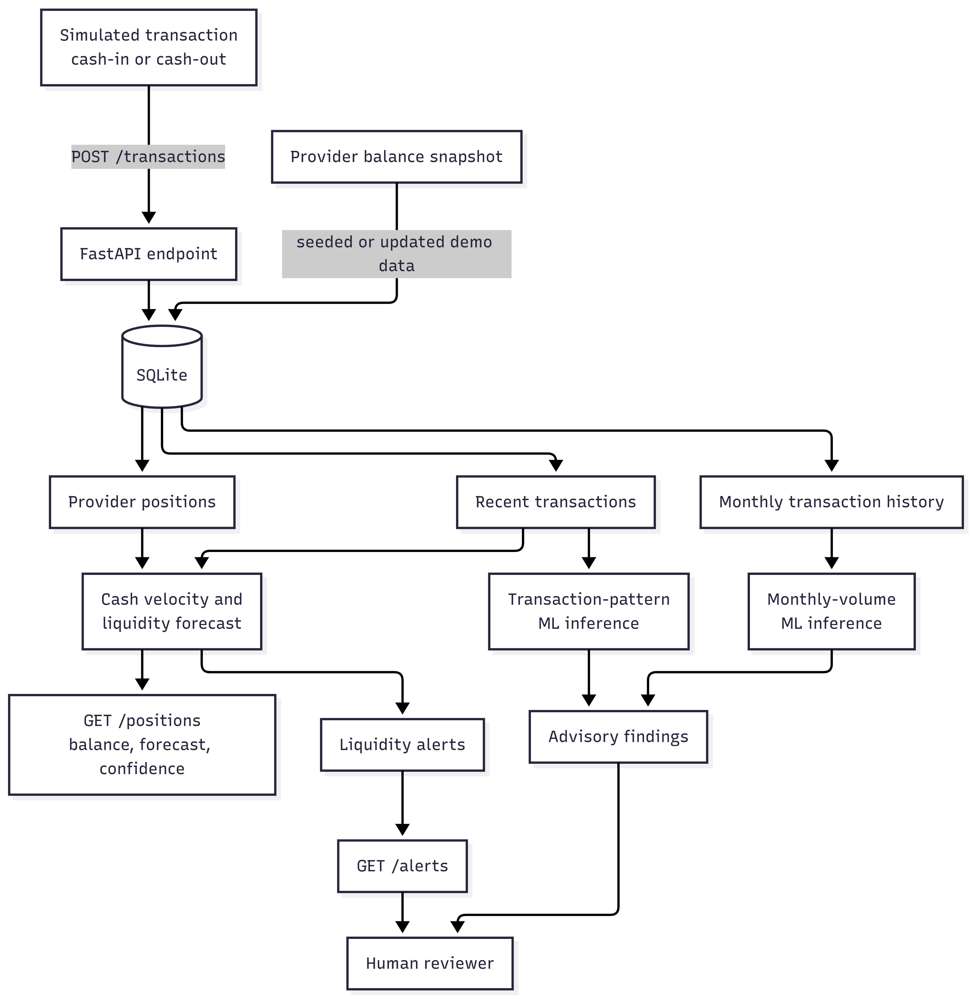
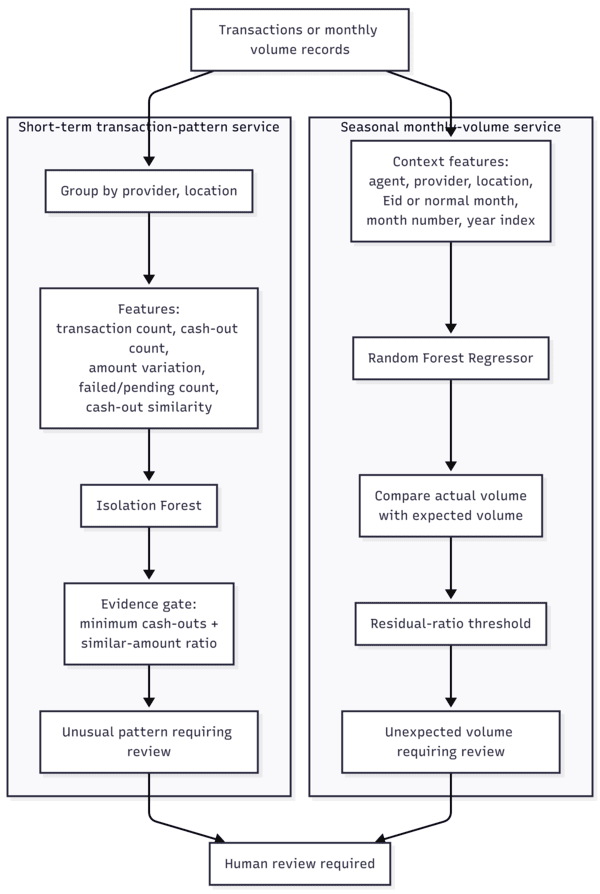
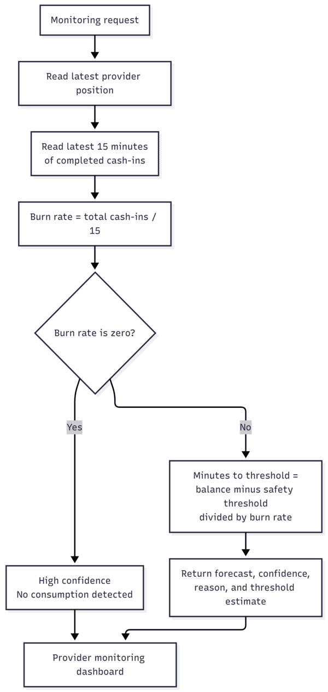
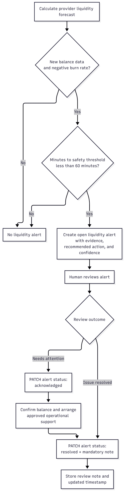

# Multi-Provider Liquidity Monitor

A synthetic, advisory-only decision-support prototype for monitoring an agent's shared physical cash and separate e-money balances across simulated bKash, Nagad, and Rocket providers.

It estimates liquidity pressure, detects selected unusual transaction patterns, identifies unexpected seasonal monthly volume, and keeps alert resolution under human control. The application does not connect to real wallets, move money, block transactions, or make fraud decisions.

# Hosted Website link
```
https://sust-final-1.onrender.com/login.html
```
# Hosted Backend
```
https://sust-final.onrender.com/docs
```

## Table of contents

- [Features](#features)
- [Architecture](#architecture)
- [Dataset and Machine Learning Models](#dataset-and-machine-learning-models)
- [Validation Evidence (Availability, Reliability, Maintainability)](#validation-evidence-availability-reliability-maintainability)
- [Project structure](#project-structure)
- [Prerequisites](#prerequisites)
- [Quick start](#quick-start)
- [Using the API](#using-the-api)
- [Demo scenarios](#demo-scenarios)
- [Current limitations](#current-limitations)
- [Safety and data note](#safety-and-data-note)

## Features

- Tracks shared physical cash plus a separate simulated e-money balance for each provider.
- Forecasts e-money depletion using recent completed cash-in demand.
- Creates explainable liquidity alerts that a human can acknowledge or resolve with a note.
- Scores unusual short-term transaction patterns with an Isolation Forest and an evidence gate.
- Scores unexpected monthly volume with seasonal context, including normal versus Eid periods.
- Exposes evaluation metrics for the synthetic ML datasets.
- Includes a static dashboard interface and FastAPI's interactive OpenAPI documentation.

## Architecture
### Main Interfaces

### Backend Architecture

### Data Flow

### AI Services

### Transaction Liquidity

### Alert-condition and human-review flow


## Dataset and Machine Learning Models
We use two models because they solve two different kinds of unusual activity.

| Model | Problem it solves | Why it fits |
|---|---|---|
| Isolation Forest | Sudden unusual transaction pattern in minutes | It finds rare patterns without needing many real fraud labels. |
| Random Forest Regressor | Monthly volume much higher than expected | It predicts normal monthly volume using agent, provider, location, month, and Eid context. |

The dataset `backend/scripts/scenario2_transactions.csv` containing 6862 synthetic transaction data was used for training the models

Isolation Forest is used for short-term behavior.

Example:

```text
12 similar Nagad cash-outs
within 10 minutes
around ৳5,000 each
```

This is different from normal transaction behavior. We do not have real labeled fraud data, so Isolation Forest is a good choice because it learns what normal-looking windows are and flags rare-looking windows.

It is also combined with clear review gates:

```text
At least 10 cash-outs
At least 75% similar amounts
ML anomaly score above threshold
```

That makes the flag explainable and reduces false positives from random activity.

Random Forest Regressor is used for long-term seasonal behavior.

Example:

```text
Normal month expected: ৳100,000
Actual monthly volume:  ৳350,000
→ Requires review
```

But during Eid:

```text
Expected Eid volume: ৳500,000
Actual volume:       ৳520,000
→ Likely normal seasonal demand
```

A Random Forest is suitable because expected monthly volume depends on several non-linear factors together:

- agent
- provider
- location
- month
- year trend
- Eid or normal context

It can learn that Eid volume is normally high without requiring you to manually write many complex rules. 

## Validation Evidence (Availability, Reliability, Maintainability)
Availability can be checked from this status page,
```
https://kn50r7tw.status.cron-job.org/
```
Reliability and maintainability can be tracked from this link from **sonarcloud**,
```
https://sonarcloud.io/project/overview?id=abdullaalshahariar_SUST_final
```

## Project Structure
```
SUST_final/
├── backend/
│   ├── app.py                 # FastAPI routes
│   ├── db.py                  # SQLite setup and synthetic data seeding
│   ├── models.py              # SQLAlchemy models and Pydantic schemas
│   ├── tools.py               # Liquidity forecast and alert logic
│   ├── ml.py                  # Short-term transaction-pattern scoring
│   ├── seasonal_ml.py         # Seasonal monthly-volume scoring
│   ├── scripts/               # Synthetic data, trained models, and metrics
│   └── data/mvp.db            # Local generated SQLite database
├── frontend/
│   ├── index.html             # Static dashboard
│   ├── style.css
│   └── script.js              # Current mock dashboard data and rendering
├── docs/
│   └── images/                # Put README screenshots and diagrams here
├── plan.md                    # Original project plan
└── README.md
```

## Prerequisites

- Python 3.10 or newer
- `pip`
- A modern web browser for the dashboard

Create and activate a virtual environment from the repository root.

   ```bash
   python3 -m venv .venv
   source .venv/bin/activate
   ```

2. Install the backend dependencies.

   ```bash
   pip install -r backend/requirements.txt
   ```

3. Start the API.

   ```bash
   uvicorn app:app --app-dir backend --reload
   ```

4. Open the interactive API documentation at [http://127.0.0.1:8000/docs](http://127.0.0.1:8000/docs).

5. Seed the deterministic synthetic demo by calling `POST /demo/reset` in Swagger UI, or run:

   ```bash
   curl -X POST http://127.0.0.1:8000/demo/reset
   ```

6. Open `frontend/index.html` in a browser to view the current static dashboard.

## Quick Start
**Quick Start (Local)**

- Prereqs: Python 3.10+ and `pip`.

- Install backend deps (from repo root):

  - `python3 -m venv .venv`
  - `source .venv/bin/activate`
  - `pip install -r backend/requirements.txt`

- Run the backend API:

  - `uvicorn app:app --app-dir backend --reload`

- (Optional) Reset/seed demo data:

  - `curl -X POST http://127.0.0.1:8000/demo/reset`

- Check the API is up:

  - `curl http://127.0.0.1:8000/health`
  - Open docs: `http://127.0.0.1:8000/docs`

- Open the frontend:

  - Open `frontend/login.html` in your browser (or `frontend/index.html` if you use the redirect page).
  - The dashboards call the API using the configured base URL in `frontend/api-config.js`.

**Quick Start (Deployed on Render)**

- Frontend: `https://sust-final-1.onrender.com`
- Backend API: `https://sust-final.onrender.com`
- Health check: `https://sust-final.onrender.com/health`
- API docs: `https://sust-final.onrender.com/docs`

## Using the API

| Goal                              | Endpoint                         | Method  |
| --------------------------------- | -------------------------------- | ------- |
| Confirm the service is running    | `/health`                        | `GET`   |
| Rebuild synthetic demo data       | `/demo/reset`                    | `POST`  |
| Simulate a stale provider balance | `/demo/simulate-stale-balance`   | `POST`  |
| View providers                    | `/providers`                     | `GET`   |
| View positions and forecasts      | `/positions`                     | `GET`   |
| View active alerts                | `/alerts`                        | `GET`   |
| Acknowledge or resolve an alert   | `/alerts/{alert_id}`             | `PATCH` |
| View recent transactions          | `/transactions`                  | `GET`   |
| Add a synthetic transaction       | `/transactions`                  | `POST`  |
| Analyse cash reserve velocity     | `/cash_reserve_analysis?w=15`    | `GET`   |
| Score transaction patterns        | `/inference/transaction-pattern` | `POST`  |
| Score monthly-volume records      | `/inference/monthly-volume`      | `POST`  |
| Retrieve synthetic model metrics  | `/metrics`                       | `GET`   |

### Example: inspect liquidity

```bash
curl http://127.0.0.1:8000/positions
curl 'http://127.0.0.1:8000/cash_reserve_analysis?w=15'
```

### Example: resolve an alert

Resolution always needs a human review note.

```bash
curl -X PATCH http://127.0.0.1:8000/alerts/1 \
  -H 'Content-Type: application/json' \
  -d '{"status":"resolved","note":"Provider balance was confirmed and operational support arranged."}'
```
I and analytics

### Liquidity forecast

For each provider, the service uses completed cash-in transactions from the latest 15 minutes:

```text
burn rate per minute = recent cash-in total / 15
minutes to threshold = (balance - safety threshold) / burn rate
```

If the position is stale or more than 15 minutes old, no depletion estimate is returned. Instead, the API returns a low-confidence result and asks for balance confirmation.

### Short-term transaction pattern analysis

The transaction-pattern service groups activity by provider, location, and ten-minute window. It uses an Isolation Forest plus an evidence gate based on repeated cash-outs and similar cash-out amounts. A result means **requires human review**; it is not a fraud conclusion.

### Seasonal monthly-volume analysis

The monthly-volume service uses a Random Forest Regressor to estimate expected volume for an agent, provider, location, month, year index, and seasonal context (`normal` or `eid`). It only flags volumes far above the expected contextual baseline.

## Demo scenarios

After `POST /demo/reset`, the local database contains synthetic examples for demonstration:

1. **Liquidity pressure:** the first agent has sustained Nagad cash-in demand that causes a near-threshold e-money forecast and a liquidity alert.
2. **Short-term anomaly:** the second agent has a ten-minute burst of similarly sized cash-outs for transaction-pattern review.
3. **Unexpected monthly volume:** the third agent has an unusually high current-month bKash volume for seasonal analysis.


## Current limitations

- All providers, balances, transactions, and model results are synthetic.
- ML metrics are offline results from generated data, not proof of real-world performance.

## Safety and data note

This prototype is for demonstration and operational decision support only. Treat all forecasts and ML outputs as advisory signals that require human verification. Do not use it to make fraud determinations or to store customer credentials, PINs, OTPs, or other sensitive personal data.

