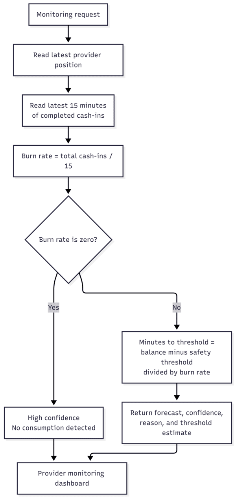

# Multi-Provider Liquidity Monitor

A synthetic, advisory-only decision-support prototype for monitoring an agent's shared physical cash and separate e-money balances across simulated bKash, Nagad, and Rocket providers.

It estimates liquidity pressure, detects selected unusual transaction patterns, identifies unexpected seasonal monthly volume, and keeps alert resolution under human control. The application does not connect to real wallets, move money, block transactions, or make fraud decisions.

## Table of contents

- [Features](#features)
- [Architecture](#architecture)
- [Project structure](#project-structure)
- [Prerequisites](#prerequisites)
- [Quick start](#quick-start)
- [Using the API](#using-the-api)
- [AI and analytics](#ai-and-analytics)
- [Alert lifecycle](#alert-lifecycle)
- [Demo scenarios](#demo-scenarios)
- [Adding photos and screenshots](#adding-photos-and-screenshots)
- [Current limitations](#current-limitations)
- [Safety and data note](#safety-and-data-note)

## Features

- Tracks shared physical cash plus a separate simulated e-money balance for each provider.
- Forecasts e-money depletion using recent completed cash-in demand.
- Creates explainable liquidity alerts that a human can acknowledge or resolve with a note.
- Scores unusual short-term transaction patterns with an Isolation Forest and an evidence gate.
- Scores unexpected monthly volume with seasonal context, including normal versus Eid periods.
- Exposes evaluation metrics for the synthetic ML datasets.
- Includes a static dashboard interface and FastAPI's interactive OpenAPI documentation.

## Architecture
### Main Interfaces

### Backend Architecture

### Data Flow

### AI Services

### Transaction Liquidity

### Alert-condition and human-review flow

